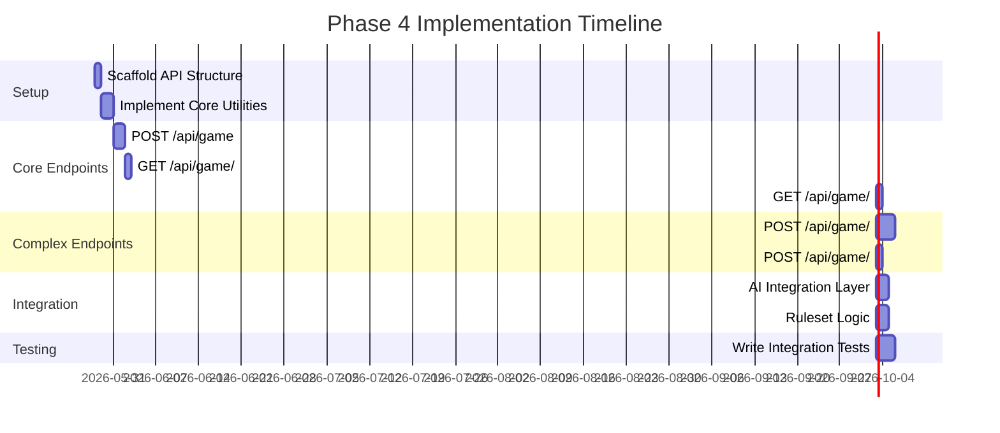

# Phase 4 Detailed Execution Plan

## Current Codebase Structure Analysis

The current structure shows:
- `packages/shared/` - Complete with types, ruleset, and board utilities
- `apps/web/src/models/` - Game model and service with MongoDB integration
- `apps/web/tests/` - Existing tests for game model and service

## Detailed Task Breakdown

### Task 4.1: Scaffold Hono API Structure
**Sub-tasks:**
- [ ] Create `apps/web/server/` directory
- [ ] Add `apps/web/server/index.ts` - Main Hono server entry point
- [ ] Add `apps/web/server/routes.ts` - Route definitions
- [ ] Add `apps/web/server/config.ts` - Configuration and environment variables
- [ ] Update `apps/web/package.json` with server scripts
- [ ] Add TypeScript configuration for server code

**Files to create:**
```
apps/web/server/
├── index.ts          # Main server entry
├── routes.ts         # Route definitions
├── config.ts         # Configuration
├── types.ts          # API types
└── utils/            # Utilities
```

### Task 4.2: Implement Core API Utilities
**Sub-tasks:**
- [ ] Create `apps/web/server/utils/validation.ts` - Input validation utilities
- [ ] Create `apps/web/server/utils/errorHandler.ts` - Error handling middleware
- [ ] Create `apps/web/server/utils/cors.ts` - CORS configuration
- [ ] Create `apps/web/server/utils/ruleset.ts` - Ruleset validation middleware
- [ ] Create `apps/web/server/utils/aiClient.ts` - AI service client

**Implementation notes:**
- Use shared package's `validateRuleSet` function
- Implement proper error handling for all API endpoints
- Add request logging middleware

### Task 4.3: Implement POST /api/game
**Sub-tasks:**
- [ ] Add route handler in `routes.ts`
- [ ] Implement input validation for game creation parameters
- [ ] Use `createGame` from game.service.ts
- [ ] Return proper response format with game ID and initial state
- [ ] Handle different game modes (pvp, pva, ava)

**Request body:**
```typescript
{
  ruleset: RuleSet,
  mode: 'pvp' | 'pva' | 'ava',
  difficulty?: 'easy' | 'medium' | 'hard',  // required if mode includes AI
  ai_team?: 'red' | 'black'                 // required if mode includes AI
}
```

### Task 4.4: Implement GET /api/game/:gameId/state
**Sub-tasks:**
- [ ] Add route handler
- [ ] Fetch game using `getGameById` from game.service.ts
- [ ] Return comprehensive game state
- [ ] Handle 404 for non-existent games
- [ ] Include ruleset information in response

**Response format:**
```typescript
{
  success: true,
  data: {
    gameId: string,
    board: string,
    turn: 'red' | 'black',
    status: 'active' | 'red_wins' | 'black_wins' | 'draw',
    mode: 'pvp' | 'pva' | 'ava',
    difficulty?: 'easy' | 'medium' | 'hard',
    ai_team?: 'red' | 'black',
    move_count: number,
    ruleset: RuleSet,
    created_at: string,
    updated_at: string
  }
}
```

### Task 4.5: Implement GET /api/game/:gameId/legal
**Sub-tasks:**
- [ ] Add route handler with query parameter support
- [ ] Parse board string using `parseBoardString` from shared package
- [ ] Get legal moves using `getLegalMoves` from shared package
- [ ] Handle optional row/col query parameters for specific piece
- [ ] Return formatted legal moves

**Query parameters:**
- `row`: optional number - specific piece row
- `col`: optional number - specific piece column

### Task 4.6: Implement POST /api/game/:gameId/move
**Sub-tasks:**
- [ ] Add route handler
- [ ] Validate player turn matches current game turn
- [ ] Parse and validate move using shared package utilities
- [ ] Apply move using `applyMove` function
- [ ] Update game state using `addMoveToHistory` from game.service.ts
- [ ] Check game over condition using `isGameOver`
- [ ] If AI turn follows and mode is pva/ava:
  - Call AI service with current game state and ruleset
  - Validate AI response
  - Apply AI move
  - Update game state again
- [ ] Return updated game state

**Request body:**
```typescript
{
  from: [number, number],
  to: [number, number],
  captures: [number, number][],
  promotion: boolean
}
```

### Task 4.7: Implement POST /api/game/:gameId/resign
**Sub-tasks:**
- [ ] Add route handler
- [ ] Validate resigning player matches current turn
- [ ] Update game status based on current player
- [ ] Add resignation entry to game history
- [ ] Return final game state

### Task 4.8: Implement AI Integration Layer
**Sub-tasks:**
- [ ] Create AI client in `apps/web/server/utils/aiClient.ts`
- [ ] Implement retry logic (3 attempts max)
- [ ] Add 10-second timeout handling
- [ ] Validate AI responses include correct ruleset
- [ ] Handle different difficulty levels
- [ ] Add performance logging

**AI Service Integration Flow:**
1. Check if AI move is needed (pva/ava mode and AI's turn)
2. Prepare request with current board, ruleset, difficulty
3. Call AI service with timeout
4. Validate response format and ruleset consistency
5. Apply AI move to game state
6. Update game in database

### Task 4.9: Implement Ruleset-Specific Logic
**Sub-tasks:**
- [ ] Add ruleset validation middleware
- [ ] Ensure all moves include proper ruleset context
- [ ] Validate move ruleset matches game ruleset
- [ ] Add ruleset information to all relevant responses
- [ ] Handle ruleset-specific move validation

### Task 4.10: Write Integration Tests
**Sub-tasks:**
- [ ] Create `apps/web/tests/api/` directory
- [ ] Write tests for game creation endpoint
- [ ] Write tests for move validation and application
- [ ] Write tests for AI integration (mock and real)
- [ ] Write tests for game over detection
- [ ] Write tests for error cases

**Test files:**
```
apps/web/tests/api/
├── gameCreation.test.ts
├── moveValidation.test.ts
├── aiIntegration.test.ts
├── gameState.test.ts
└── errorCases.test.ts
```

## Implementation Sequence



## Verification Checklist

- [ ] All API endpoints implemented according to spec
- [ ] Proper error handling for all endpoints
- [ ] Ruleset validation working correctly
- [ ] AI integration functioning with all difficulty levels
- [ ] All tests passing
- [ ] Code follows TypeScript best practices
- [ ] No breaking changes to existing functionality
- [ ] Documentation updated

## Next Steps

1. Begin with Task 4.1: Scaffold Hono API Structure
2. Implement core utilities in Task 4.2
3. Proceed with endpoint implementation in logical order
4. Test thoroughly at each stage
5. Integrate with AI service and complete testing